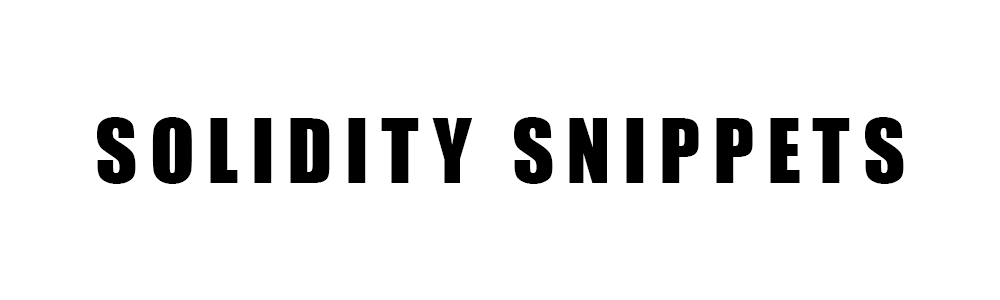
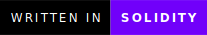

  

 
 
Solidity snippets is a set of miscellaneous and unrelated scripts, built to try different configurations.

I wanted a place to test miscellaneous solidity snippets .

**This is why I created this project**.

[Key Features](#key-features) •
[Installation](#installation) •
[Technologies Used](#technologies-used) •
[Contact Me](#contact-me) 

<!---->

## Key Features

- Miscellaneous and unrelated scripts.
- Testing and playing with different ideas.
- It can work with both on-prem and in the cloud (AWS, Azure, GCP...etc).

## Technologies Used

| Application                                         | Description                                  
| --------------------------------------------------- |--------------------------------------------- 
| [Blockchain](https://www.ibm.com/topics/blockchain)                           | A shared, immutable ledger that facilitates the process of recording transactions and tracking assets in a business network                 
| [Ethereum](https://ethereum.org/)                 | A decentralized blockchain with smart contract functionality  
| [Solidity](https://ethereum.org/)                 | An  object-oriented programming language for implementing smart contracts on various blockchain platforms, most notably, Ethereum                                    
| [Markdown Guide](https://www.markdownguide.org/)    | A reference guide that explains how to use markdown                                 

## Contact Me

